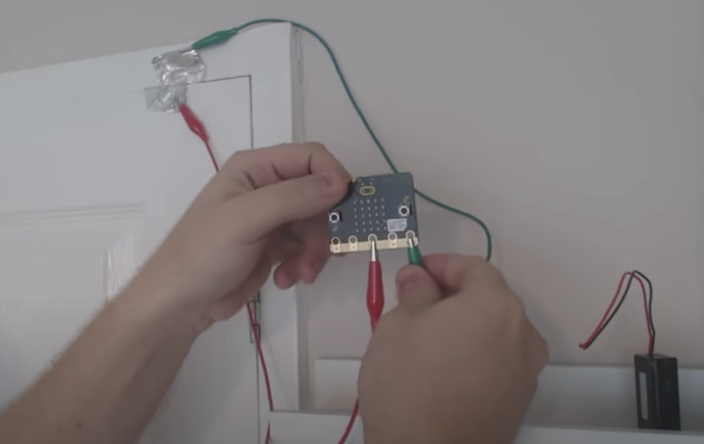
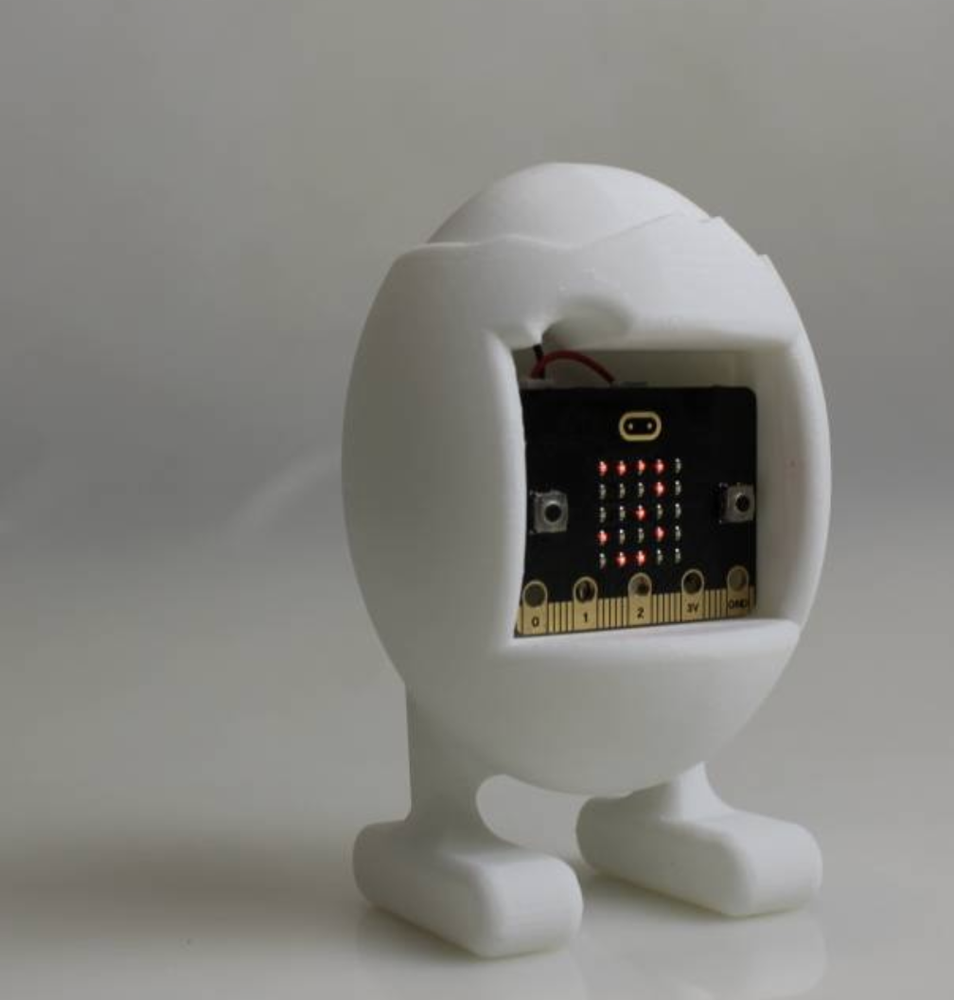

# 1701QCA Making Interaction - Assessment 2 workbook

You will use this workbook to keep track of your progress through the course and also as a process journal to document the making of your projects. The comments in italics throughout the template give suggestions about what to include. Feel free to delete those instructions when you have completed the sections.

When you have completed the template, submit the link to the GitHub Pages site for this repository as a link in Learning@Griffith. The link should be something like [https://qcainteractivemedia.github.io/1701QCA-Assessment2/](https://qcainteractivemedia.github.io/1701QCA-Assessment2/) where `qcainteractivemedia` is replaced with your GitHub username and `1701QCA-Assessment2` is replaced with whatever you called the repository this template is contained in when you set it up.

## Project working Title ##
WaterFlow

## Related projects ##
*Find about 6 related projects to the project you choose. A project might be related through  function, technology, materials, fabrication, concept, or code. Don't forget to place an image of the related project in the appropriate folder and insert the filename in the appropriate places below. Copy the markdown block of code below for each project you are showing.*

### Related project 1 ###
Security Box

https://make.techwillsaveus.com/microbit/activities/security-box

This project is related to the project that I am creating because it sets off an alarm. This is a feature that is being utilised in my project.  The alarm in this project is used to alert the owner when someone has opened the box, whereas the alarm in my project is being used to alert the user when it is time to have another drink. 

### Related project 2 ###
Countdown Timer

https://makecode.microbit.org/projects/watch/timer

This project is related to the project that I am creating because it involves a timer that countdown. In my project, the timer will reactivate every 5 minutes, this will then trigger an output that tells the user it is time to drink once again. 

### Related project 3 ###
Making a Room Alarm With Your Micro: bit

https://www.youtube.com/watch?v=igeUhVMqVRw

This project is related to the project that I am creating because it once again is an alarm. This is a factor that is going to be used in this project. However, this alarm is activated when it is trigger, acting as a security system, whereas my project has an alarm that goes off after a certain time rather than when it is triggered.

### Related project 4 ###
Micro: bit Name Tag

https://www.seeedstudio.com/blog/2019/12/10/top-25-microbit-projects-for-beginners-2019/

This project is related to the project that I am creating because it displays a string of text on the micro: bit LED screen. My project will display the words “drink water” when the timer is up. 

### Related project 5 ###
Reading Temperature Using Micro: bit

https://www.seeedstudio.com/blog/2019/12/10/top-25-microbit-projects-for-beginners-2019/

This project is related to the project that I am creating because it uses a motor to control the temperature gauge. I will be using a motor in my project to turn the platform that the water bottle sits on. 

### Related project 6 ###
Micro: bit Egg Timer

https://www.myminifactory.com/object/3d-print-micro-bit-egg-timer-18361

This project is related to the project that I am creating because it is a timer. In my project, I will be using an automatic countdown timer to indicate when the outputs go off. This project lets the individual once the egg has finished cooking using an automatic timer. 

## Other research ##
*Include here any other relevant research you have done. This might include identifying readings, tutorials, videos, technical documents, or other resources that have been helpful. For each particular source, add a comment or two about why it is relevant or what you have taken from it.*

### *Brief resource name/description* ###

*Provide a link, reference, or whatever is required for somebody else to find the resource. Then provide a few comments about what you have drawn from the resource.*

## Conceptual progress ##

### Design intent ###
*Include your design intent here. It should be about a 10 word phrase/sentence.*

### Design concept 1 ###

### Design concept 2 ###

### Final design concept ###

### Interaction flowchart ###
*Draw a draft flowchart of what you anticipate the interaction process in your project to be. Make sure you think about all the stages of interaction step-by-step. Also make sure that you consider actions a user might take that aren't what you intend in an ideal use case. Insert an image of it below. It might just be a photo of a hand-drawn sketch, not a carefully drawn digital diagram. It just needs to be legible.*

## Physical experimentation documentation ##

*In this section, show your progress including whichever of the following are appropriate for your project at this point.
a.	Technical development. Could be code screenshots, pictures of electronics and hardware testing, video of tests. 
b.	Fabrication. Physical models, rough prototypes, sketches, diagrams of form, material considerations, mood boards, etc.
Ensure you include comments about the choices you've made along the way.*

*You will probably have a range of images and screenshots. Any test videos should be uploaded to YouTube or other publicly accessible site and a link provided here.*

## Design process discussion ##
*Discuss your process in getting to this point, particularly with reference to aspects of the Double Diamond design methodology or other relevant design process.*

## Next steps ##
*Write a list or provide other information about your plan to move the project forward to be ready to present by video and documentation in week 12 of the course.*
