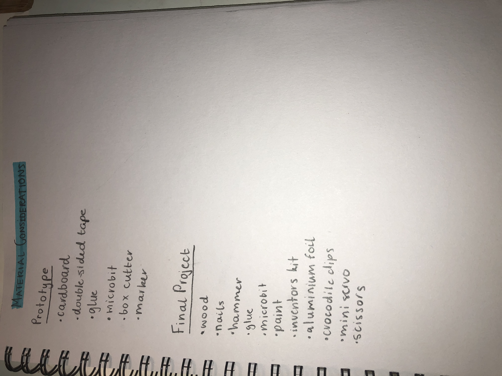

# 1701QCA Making Interaction - Assessment 2 workbook

## Project working Title ##
WaterFlow - Reminder to keep hydrated

## Related projects ##
*Find about 6 related projects to the project you choose. A project might be related through  function, technology, materials, fabrication, concept, or code. Don't forget to place an image of the related project in the appropriate folder and insert the filename in the appropriate places below. Copy the markdown block of code below for each project you are showing.*

### Related project 1 ###
Security Box

https://make.techwillsaveus.com/microbit/activities/security-box

This project is related to the project that I am creating because it sets off an alarm. This is a feature that is being utilised in my project.  The alarm in this project is used to alert the owner when someone has opened the box, whereas the alarm in my project is being used to alert the user when it is time to have another drink. 

### Related project 2 ###
Countdown Timer

https://makecode.microbit.org/projects/watch/timer

This project is related to the project that I am creating because it involves a timer that countdown. In my project, the timer will reactivate every 5 minutes, this will then trigger an output that tells the user it is time to drink once again. 

### Related project 3 ###
Making a Room Alarm With Your Micro: bit

https://www.youtube.com/watch?v=igeUhVMqVRw

This project is related to the project that I am creating because it once again is an alarm. This is a factor that is going to be used in this project. However, this alarm is activated when it is trigger, acting as a security system, whereas my project has an alarm that goes off after a certain time rather than when it is triggered.

### Related project 4 ###
Micro: bit Name Tag

https://www.seeedstudio.com/blog/2019/12/10/top-25-microbit-projects-for-beginners-2019/

This project is related to the project that I am creating because it displays a string of text on the micro: bit LED screen. My project will display the words “drink water” when the timer is up. 

### Related project 5 ###
Reading Temperature Using Micro: bit

https://www.seeedstudio.com/blog/2019/12/10/top-25-microbit-projects-for-beginners-2019/

This project is related to the project that I am creating because it uses a motor to control the temperature gauge. I will be using a motor in my project to turn the platform that the water bottle sits on. 

### Related project 6 ###
Micro: bit Egg Timer

https://www.myminifactory.com/object/3d-print-micro-bit-egg-timer-18361

This project is related to the project that I am creating because it is a timer. In my project, I will be using an automatic countdown timer to indicate when the outputs go off. This project lets the individual once the egg has finished cooking using an automatic timer. 

## Other research ##
### *Brief resource name/description* ###
https://makecode.microbit.org/device/servo

As I have not tested the motor yet, I am unsure as to whether I will need to use a mini servo instead in my project to assist with the turning of the water bottles platform. This site explains how to equip the servo with “crocodile clips” that have been created from male strips. 

https://makecode.microbit.org/v0/86038-41904-40055-73164

The following source shows the code required for an alarm to play. This can be beneficial when creating the code for this project as it assists in creating alarm reminding the user to drink water. 

https://www.kitronik.co.uk/blog/using-bbc-microbit-control-servo/

This source explains how to use the BBC Micro: bit to control the servo. This is important as it will assist me in getting the servo to work effectively and spin the platform at the correct speed. 

https://support.microbit.org/support/solutions/articles/19000024000-fault-finding-with-a-micro-bit

In the past, I have had issues attempting to get the micro: bit to work. This website gives me a step by step guide as to how to get the micro: bit working again if the issues reoccur. This is extremely beneficial as it can endure that I do not waste time trying to fix the micro: bit on my own. 

## Conceptual progress ##

### Design intent ###
In today's society, it is extremely common for people to forget to remain hydrated due to their busy schedule. This project will remind users when they need to drink water to ensure that they remain hydrated and healthy throughout the day. 

### Design concept 1 ###

### Design concept 2 ###

### Final design concept ###

### Interaction flowchart ###

## Physical experimentation documentation ##

This was the first rough sketch of the main idea. In this sketch, i wrote in a step by step process, how the project owuld work and what the outputs would be/how they would be acheived. I also wrote out the base materials that I assumed would have been required at the time. 

This was a more thorough materials list that I wrote once I had chosen the project that I was going to create. This gave me an idea as to what I would need for both the prototype and the final project. It is still yet to be expanded. 

This is the prototype of the project that I am going to create. This was built using carboard as it was only a rough outline of how I wanted the final project to look. Creating this prototype allowed for me to correctly find out the measurments of the project so that when I am making the final project, I successfully use the correct measurements to ensure that everything fits perfectly. 

This is part of the code that I have been testing. Rather than doing all of the code at once, I decided to break it down so that I could ensure that each section of my code is correct. This is the code that I was working on for the alarm rhat is going to play. In this code I worked on finding the correct melody that I wanted to play to alert the users. 

This was the part of the code to control the mini servo. It still needs to be modified and added to, but I was focusing on getting a base for this code down so that I could unerstand how and if it works before I move forward. 

## Design process discussion ##
*Discuss your process in getting to this point, particularly with reference to aspects of the Double Diamond design methodology or other relevant design process.*

## Next steps ##
The next steps required for this project to be completed by the week 12 deadline include: 
. obtaining the final materials from a hardware store so that commencment of the final project can take place. 
. building the final project and modifying certain sections to ensure that the platform can hold the bottle safetly whilst still effectively being able to turn. 
. continuing to work on the code to ensure that all results are achieved in the end. 
. putting all of the final code together into one section so that when the project is tested, all of the outputs occur at the same time.
. testing the product. 
. presenting the final product. 
